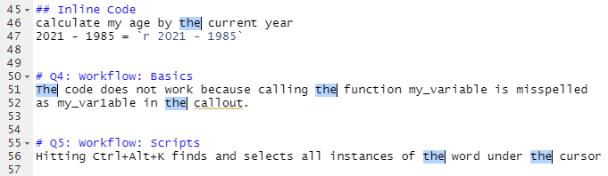

# Q1: Loaded the following libraries:
```{r message=FALSE}
library(tidyverse)
library(haven)
library(car)
library(Hmisc)
```


# Q2: Imported the data "mto_sci_puf_cells_20130206.dta"
```{r results ='hide'}
mto_data <- read_dta("Data/mto_sci_puf_cells_20130206.dta") 
mto_data

```
It was unclear from the homework instructions whether we needed to fully
present the analysis of the data similar to the example. I have assumed
that it was not necessary and we only needed to import the base data set
to demonstrate that it was done as shown above.

# Q3: Format RMarkdown  
## Small header  
**Bold Text** Regular Text  

## Unordered List  
* Favorite Foods:  
    + Filet Mignon  
    + Pizza  
    + Chicken Alfredo  
* Least Favorite Food:  
    + Mushrooms  
    + Celery  
    + Sardines  
    
## Inserted Image  
My wife and I in Montmartre, Paris - Sept. 2019  
.jpg)  

## Inline Code  
calculate my age by the difference in the current year and my birth year  
2021 - 1985 = `r 2021 - 1985`  


# Q4: Workflow: Basics  
The code does not work because calling the function my_variable is misspelled
as my_var1able in the callout.  


# Q5: Workflow: Scripts  
Moving the cursor over a word and hitting Ctrl+Alt+K finds and selects all
instances of the word under the cursor  




# Q6: Research Ethics  
I believe that overselling is the hardest pitfall to prevent. I hold this
belief because it is the easiest trap to fall into when a researcher has
dedicated a significant amount of time investigating and analyzing data. The
desire for your work to mean something and be significant (and not be a waste
of time) is overwhelming in this scenario. Even if you don't mean to, it
can be very easy to oversell your work as important.  


# Q7: Knit PDF  
If you're reading this, it was a success!


